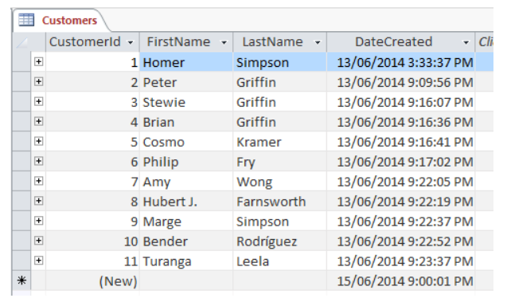
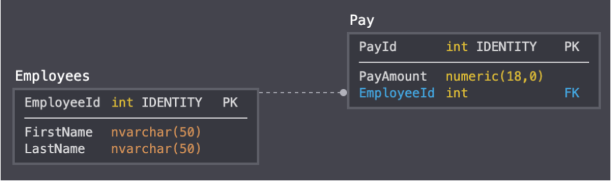
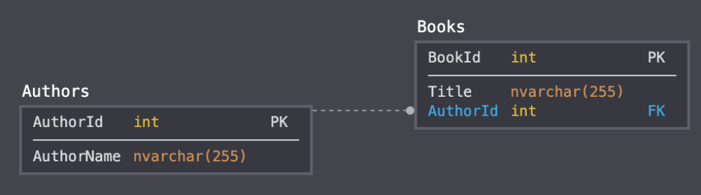
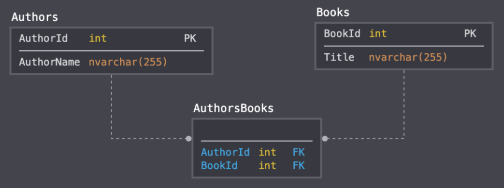
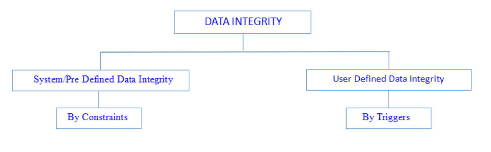
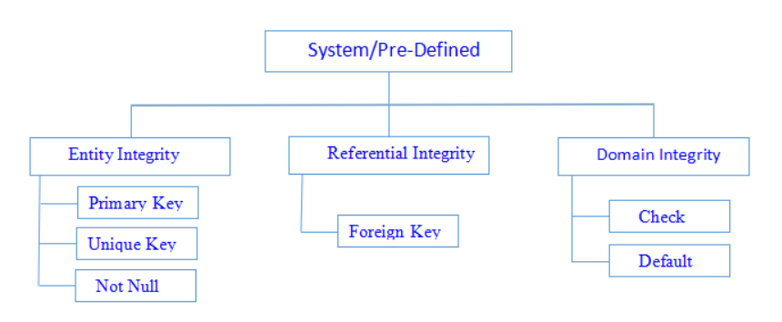

# SQL Basics

> *Click &#9733; if you like the project. Your contributions are heartily ♡ welcome.*

<br/>

## Related Topics

* *[SQL Commands](sql-commands.md)*
* *[SQL Query Practice](sql-query-practice.md)*

<br/>

## Table of Contents

* [Introduction](#-1-introduction)
* [SQL Data Types](#-2-sql-data-types)
* [SQL Database](#-3-sql-database)
* [SQL Table](#-4-sql-table)
* [SQL Select](#-5-sql-select)
* [SQL Clause](#-6-sql-clause)
* [SQL Order By](#-7-sql-order-by)
* [SQL Insert](#-8-sql-insert)
* [SQL Update](#-9-sql-update)
* [SQL Delete](#-10-sql-delete)
* [SQL Keys](#-11-sql-keys)
* [SQL Join](#-12-sql-join)
* [SQL RegEx](#-13-sql-regex)
* [SQL Indexes](#-14-sql-indexes)
* [SQL Wildcards](#-15-sql-wildcards)
* [SQL Date Format](#-16-sql-date-format)
* [SQL Transactions](#-17-sql-transactions)
* [SQL Functions](#-18-sql-functions)
* [SQL View](#-19-sql-view)
* [SQL Triggers](#-20-sql-triggers)
* [SQL Cursors](#-21-sql-cursors)
* [SQL Stored Procedures](#-22-sql-stored-procedures)
* [Miscellaneous](#-23-miscellaneous)

<br/>

## # 1. Introduction

<br/>

## Q. What is a database?

A database is a systematic or organized collection of related information that is stored in such a way that it can be easily accessed, retrieved, managed, and updated.

**Syntax:**

```sql
CREATE DATABASE <databaseName>
```

**Example:**

```sql
CREATE DATABASE Product
```

## Q. What is a database table?

A database table is a structure that organises data into rows and columns – forming a grid.

Tables are similar to a worksheets in spreadsheet applications. The rows run horizontally and represent each record. The columns run vertically and represent a specific field. The rows and columns intersect, forming a grid. The intersection of the rows and columns defines each cell in the table.

<p align="center">
  
</p>

**Syntax:**

```sql
CREATE TABLE <table_name> (ID INT, NAME VARCHAR(30) )

DROP TABLE <table_name>

SELECT * FROM <table_name>
```

<div align="right">
    <b><a href="#table-of-contents">↥ back to top</a></b>
</div>

## Q. What is a database relationship?

Database relationships are associations between tables that are created using join statements to retrieve data. It helps improve table structures and reduce redundant data.

Understanding relationship in databases is important as it allows you to fetch data from multiple tables simultaneously and helps ensure that data in databases are consistent and updated.

**Types of Database Relationships:**

**1. One-to-One:**

A one-to-one relationship is a relationship between two tables where each table can have only one matching row in the other table.

<p align="center">
  
</p>

Using the above screenshot as an example, the business case is that each employee\'s pay details must be stored in a separate table to the employee\'s contact details. In such a case, there can only be one row in the Pay table that matches a given employee in the Employees table. This is a good candidate for a one-to-one relationship.

**2. One-to-Many:**

The one-to-many relationship is similar to the one-to-one relationship, except that it allows multiple matching rows in one of the tables.

<p align="center">
  
</p>

In the above example, each author can have many books, but each book can only have one author.

Therefore, the Books table is allowed to contain multiple rows with the same AuthorId value. If an author has released five books, then there would be one row in Authors for that author, and five rows in Books, each with that author\'s AuthorId.

**3. Many-to-Many:**

In a many-to-many relationship, each side of the relationship can contain multiple rows.

<p align="center">
  
</p>

In this example, each book is allowed to have multiple authors. Therefore, I created a lookup table (also known as a "junction table") that stores both the AuthorId and the BookId.

These two columns could be configured to be the primary key of the table (in which case they would be a "composite primary key" or simply "composite key"), or you could create a separate column to be the primary key.

Note that the Books table doesn\'t have AuthorId in this case. That column has been moved to the AuthorBooks table so that we can have many AuthorIds for the same BookId.

<div align="right">
  <b><a href="#table-of-contents">↥ back to top</a></b>
</div>

## Q. What is data Integrity?

Data Integrity defines the accuracy and consistency of data stored in a database. It can also define integrity constraints to enforce business rules on the data when it is entered into the application or database.

**Classification of Data Integrity:**

* a) System/Pre Defined Integrity
* b) User-Defined Integrity

<p align="center">
  
</p>

**a) System/Pre Defined Integrity:**

<p align="center">
  
</p>

**1. Entity Integrity:**

Entity integrity ensures each row in a table is a uniquely identifiable entity. We can apply Entity integrity to the Table by specifying a primary key, unique key, and not null.

**2. Referential Integrity:**

Referential integrity ensures the relationship between the Tables.

We can apply this using a Foreign Key constraint.

**3. Domain Integrity:**

Domain integrity ensures the data values in a database follow defined rules for values, range, and format. A database can enforce these rules using Check and Default constraints.

**b) User-Defined Integrity:**

It comprises the rules defined by the operator to fulfill their specific requirements. Entity, referential, and domain integrity are not enough to refine and secure data. Time in time again, particular business rules must be considered and integrated into data integrity processes to meet enterprise standards.

<div align="right">
    <b><a href="#table-of-contents">↥ back to top</a></b>
</div>

## Q. What are the two principles of relational database model?

The two principal rules for the relational model are as follows:

- Entity integrity: this is used to maintain the integrity at entity level
- Referential integrity: it is used to maintain integrity on all the values which have been referenced.

The differences between them are as follows:

- Entity integrity tells that in a database every entity should have a unique key; on the other hand referential integrity tells that in the database every table values for all foreign keys will remain valid.
- Referential integrity is based on entity integrity but it is not the other way around.
- For example: if a table is present and there is a set of column out of which one column has parent key set then to ensure that the table doesn'\t contain any duplicate values, a unique index is defined on the column that contains the parent key.

<div align="right">
    <b><a href="#table-of-contents">↥ back to top</a></b>
</div>

## Q. What are the relational operations that can be performed on the database?

There are many relational operators that are used to perform actions on relational database. These operators are as follows:

1. Union operator that combines the rows of two relations and doesn'\t include any duplicate. It also removes the duplicates from the result.
2. Intersection operator provides a set of rows that two relations have in common.
3. Difference operator provide the output by taking two relations and producing the difference of rows from first that don'\t exist in second.
4. Cartesian product is done on two relations. It acts as a cross join operator.

<div align="right">
    <b><a href="#table-of-contents">↥ back to top</a></b>
</div>

## Q. What do you understand by database Normalization?

- Normalization is very essential part of relational model.
- Normal forms are the common form of normalization.
- It helps in reducing redundancy to increase the information overall.
- It has some disadvantages as it increases complexity and have some overhead of processing.
- It consists of set of procedures that eliminates the domains that are non-atomic and redundancy of data that prevents data manipulation and loss of data integrity.

<div align="right">
    <b><a href="#table-of-contents">↥ back to top</a></b>
</div>

## Q. What are the different types of normalization that exists in the database?

There are 9 normalizations that are used inside the database. These are as follows:

1. First normal form: in this table represents a relation that has no repeating groups.
2. Second normal form: non- prime attributes are not functional dependent on subset of any candidate key.
3. Third normal form: in a table every non- prime attribute is non-transitively dependent on every candidate key
4. Elementary key normal form: superkey dependency or elementary key dependency effects the functional dependency in a table.
5. Boyce codd normal form: “every non-trivial functional dependency in the table is dependent on superkey”.
6. Fourth normal form: “Every non-trivial multivalued dependency in the table is a dependent on a superkey”.
7. Fifth normal form (5NF): “Every non-trivial join dependency in the table is implied by the superkeys of the table”.
8. Domain/key normal form (DKNF): “Every constraint on the table is a logical consequence of the table's domain constraints and key constraints”.
9. Sixth normal form (6NF): “Table features no non-trivial join dependencies at all”.

<div align="right">
    <b><a href="#table-of-contents">↥ back to top</a></b>
</div>

## Q. How de-normalization is different from normalization?

- Analytical processing databases are not very normalized. The operations which are used are read most databases. 
- It is used to extract the data that are ancient and accumulated over long period of time. For this purpose de-normalization occurs that provide smart business applications.
- Dimensional tables in star schema are good example of de-normalized data. 
- The de-normalized form must be controlled while extracting, transforming, loading and processing. 
- There should be constraint that user should not be allowed to view the state till it is consistent.
- It is used to increase the performance on many systems without RDBMS platform.

<div align="right">
    <b><a href="#table-of-contents">↥ back to top</a></b>
</div>

## Q. What is the type of de-normalization?

Non-first normal form (NFA) 

– It describes the definition of the database design which is different from the first normal form.
- It keeps the values in structured and specialized types with their own domain specific languages. 
- The query language used in this is extended to incorporate more support for relational domain values by adding more operators.

<div align="right">
    <b><a href="#table-of-contents">↥ back to top</a></b>
</div>

## Q. How many levels of data abstraction are available?

There are three levels of data abstraction available in database model and these are as follows:

1. Physical level: It is the lowest level that describes how data is stored inside the database.
2. Logical level: It is the next higher level in the hierarchy that provides the abstraction. It describes what data are stored and the relationship between them.
3. View level: It is the highest level in hierarchy that describes part of the entire database. It allows user to view the database and do the query.

<div align="right">
    <b><a href="#table-of-contents">↥ back to top</a></b>
</div>

## Q. What do you understand by Data Independence?

Data independence tells about the independence of the data inside the application. It usually deals with the storage structure and represents the ability to modify the schema definition. It doesn'\t affect the schema definition which is being written on the higher level. 

There are two types of data independence:

1. Physical data independence: It allows the modification to be done in physical level and doesn'\t affect the logical level.
2. Logical data independence: It allow the modification to be done at logical level and affects the view level. 

NOTE: Logical Data Independence is more difficult to achieve.

<div align="right">
    <b><a href="#table-of-contents">↥ back to top</a></b>
</div>

## Q. How view is related to data independence?

- View is a virtual table that doesn'\t really exist, but it remains present so that user can view their data.
- It is derived from the base table. The view is stored in the data dictionary and represents the file directly. 
- The base table updation or reconstruction is not being reflected in views.
- It is related to the logical data independence as it is at the logical level and not at the physical level.

<div align="right">
    <b><a href="#table-of-contents">↥ back to top</a></b>
</div>
